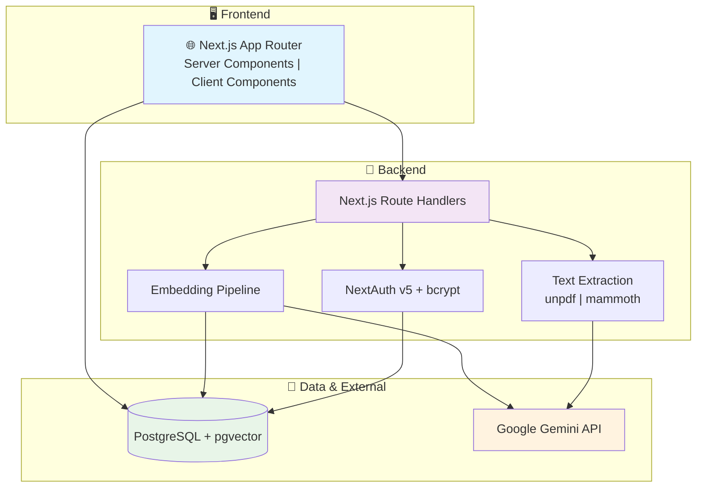
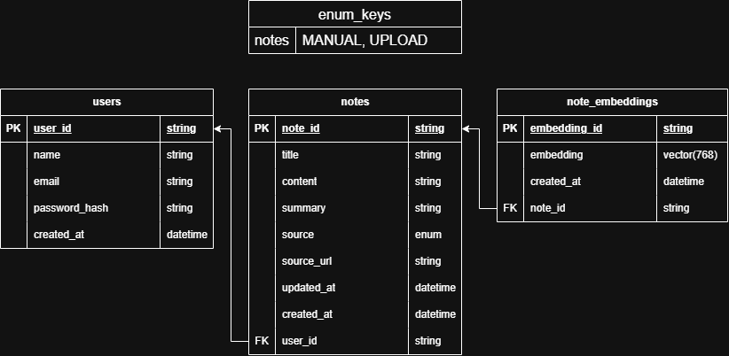

<div align="center">

# **Cortex**

**AI-Powered Notes & Document Intelligence**


</div>

## 📖 About

Cortex is a full-stack notes application that summarises what you write or upload, and also supports keyword & semantic file searching.

Notes can be written directly or created by uploading a document — PDF, Word, Markdown, or plain text. Uploaded files are parsed server-side, sent to Gemini for a generated title and structured summary, and stored as a normal note you can edit.

Search is hybrid: exact title matches are returned first, and when nothing matches, the query is embedded as a vector and compared against note embeddings stored in PostgreSQL via `pgvector`. For example, searching "version control" surfaces your git notes even though that phrase never appears in them.

**🔗 Live App:** https://cortex-jwt1f25.vercel.app/

## 🎥 Video Demo

[]

## 🏗️ Architecture Overview



## 🔄 Pipelines

**Document upload**

```
file → validate type/size → extract text → Gemini (title + summary as JSON)
     → create note → embed → store 768-dim vector
```

**Search**

```
query → title match (ILIKE)
      → if no matches: embed query → cosine distance over embeddings → nearest notes
```

## 🗄️ Database Schema



## ✨ Features

### Core Features

- 📝 **Note editor**: title, body, and an AI summary — all editable, with tabbed views for original and summary
- 📤 **Document upload**: PDF, Word (`.docx`), Markdown, and plain text, parsed server-side
- 🤖 **AI summarisation**: one-click summaries for any note; automatic on upload
- 🔍 **Hybrid search**: keyword matching with semantic fallback
- 🔐 **Full authentication**: register, login, sessions, protected routes
- 🗂️ **Note management**: rename, open in new tab, delete — with confirmation

### Advanced Features

- 🧠 **Vector semantic search**: 768-dimension embeddings stored in `pgvector`, ranked by cosine distance
- 🎯 **Measured similarity threshold**: cutoff tuned from real distance measurements, not guessed
- 📄 **Multi-format extraction**: MIME-type dispatch to the right parser per file type
- 🔁 **Structured AI output**: single Gemini call returns title and summary as JSON, parsed with fallbacks
- 🛡️ **Graceful degradation**: AI failures degrade a feature instead of breaking the request
- ⚡ **Upload toast**: modal closes immediately, progress reported in a corner toast

### Technical Features

- 🔑 **Data security**: bcrypt password hashing, session-based auth via NextAuth v5
- 🚧 **Ownership enforcement**: every note route verifies the requester owns the record — including raw SQL paths
- 🧩 **Server components**: pages query PostgreSQL directly, skipping an API round-trip on reads
- 🗃️ **Raw SQL where needed**: parameterised `$queryRaw` for vector operations Prisma can't express
- 🔒 **Server-only secrets**: API keys never reach the client; all AI calls run in route handlers
- 🚀 **CI/CD**: auto-deploy on push to main via Vercel
- ✅ **Automated tests**: Vitest covering auth, ownership enforcement, and upload validation — all external services mocked

## 🛠️ Technologies

### Framework & Language

- Next.js 16 (App Router, Server Components, Route Handlers)
- TypeScript
- React

### Backend & Data

- PostgreSQL (Neon) + `pgvector`
- Prisma ORM + migrations
- NextAuth v5 (Credentials provider) + bcryptjs

### AI

- Google Gemini — `gemini-3.6-flash` (summarisation), `gemini-embedding-2` (embeddings)

### Frontend

- Tailwind CSS
- Lucide Icons

### Document Processing

- `unpdf` (PDF text extraction, serverless-friendly)
- `mammoth` (`.docx` extraction)

### DevOps & Tools

- Vercel (hosting + CI/CD)
- Neon (managed Postgres)
- Vitest (unit tests + mocked external services)

## 🧠 Engineering Decisions

### Hybrid search, because pure vector search failed

The first version replaced keyword search entirely with semantic search. It broke on the obvious case: a note titled "Hello World" couldn't be found by typing "Hello". Embeddings capture meaning, and a short exact string carries almost none.

The fix was to try title matching first and fall back to vectors only when it returns nothing. Exact lookups work, and semantic search handles the "I can't remember what I called it" case it's genuinely good at.

### Tuning the similarity threshold from measurements

The initial cutoff was an arbitrary `0.6`, which returned unrelated notes for every query. Measuring real cosine distances across four documents showed a clear split:

| Result                                        | Distance  |
| --------------------------------------------- | --------- |
| Genuine match (git notes ← "version control") | **0.306** |
| Unrelated document                            | 0.492     |
| Unrelated document                            | 0.496     |
| Unrelated document                            | 0.501     |

That tight cluster around 0.50 is the noise floor — unrelated documents all sit roughly the same distance from any query. Setting the threshold to `0.4` puts it in the gap, so irrelevant results are excluded and "no results" becomes a possible outcome.

### Reducing embedding dimensions from 3072 to 768

The model's default output is 3072 dimensions, which `pgvector` can store but cannot index — its `hnsw` and `ivfflat` index types cap at 2000. Requesting 768 dimensions instead reduces storage, speeds up queries, and keeps indexing available if the dataset grows enough to need it.

### Prompting for extraction, not description

The first summarisation prompt asked for "concise bullet points" and produced output like _"Details repository initialisation and main branch setup"_ for a page of git commands — accurate and useless.

Adding an explicit instruction changed the behaviour entirely:

> Preserve important specifics verbatim — commands, function names, syntax, numbers, dates. Do not describe what the document is about; extract what it actually says.

### Graceful degradation around external services

Every AI call is wrapped so failure degrades one feature rather than breaking the request:

- Malformed JSON from summarisation → note created with the filename as title
- Embedding API failure on upload → note saved, just absent from semantic search
- Embedding API failure on search → falls back to keyword-only results

## ⚠️ Known Limitations

- **Embedding blocks the request** — saving a note waits on the embedding API, adding a few seconds. A background job queue is the correct fix; this is documented rather than solved.
- **No rate limiting** on AI endpoints — acceptable for personal use, not for public deployment.
- **Preview deployments share the production database** — a separate Neon branch per environment would be correct.
- **Scanned PDFs unsupported** — no text layer means nothing to extract; OCR would be required.
- **Plain-text content only** — no rich-text formatting.

## 🚀 Installation

### Prerequisites

- Node.js 18+
- A PostgreSQL database with `pgvector` (free tier at [neon.com](https://neon.com))
- A Gemini API key ([aistudio.google.com](https://aistudio.google.com/api-keys))

### Quick Start

```bash
git clone https://github.com/jwt1f24/cortex.git
cd cortex
npm install
```

Create a `.env` file in the project root:

```
DATABASE_URL="postgresql://..."
NEXTAUTH_SECRET="..."          # openssl rand -base64 32
GEMINI_API_KEY="..."
```

Enable the vector extension on your database:

```sql
CREATE EXTENSION IF NOT EXISTS vector;
```

Run migrations and start the dev server:

```bash
npx prisma migrate dev
npx prisma generate
npm run dev
```

The app runs at `http://localhost:3000`.

### Production Deployment

**Vercel:**

- Connect the GitHub repo — Next.js is auto-detected
- Add `DATABASE_URL`, `NEXTAUTH_SECRET`, and `GEMINI_API_KEY` for both Production and Preview
- Add `"postinstall": "prisma generate"` to `package.json` scripts so the Prisma client is generated during the build
- Deploys run automatically on every push to `main`

## 🗺️ Roadmap

- Background job queue for embedding and summarisation
- RAG chat — ask questions answered from your own notes
- Markdown rendering in the editor
- Automated tests for API routes
- Dark mode
